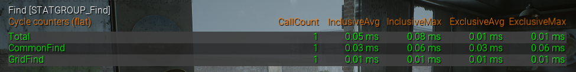

# 拆解文档

## 项目概述

## 武器系统

策略模式+数据驱动+GAS。

- **数据表格DT_WeaponData：**包括各种武器的基础数据。
- **武器基类AWeaponBase**：包括武读取数据、开火逻辑。
- **策略基类UFiringPattern**：武器开火时实际调用的逻辑，需要在数据表格中指定。
  - 策略派生类IntentNoPen：直接射线检测并附加伤害的模式（当前步枪和霰弹枪使用），命中后会激活玩家有关**命中特效**能力。

## 丧尸系统

对象池+AI行为树+数据驱动+GAS。

- **数据表格DT_Zombie**：记录各种丧尸的基础属性

- **丧尸基类AZombie**：丧尸基类，记录丧尸实时数据，实现死亡等基础逻辑。死亡由GAS数据集发送**死亡事件**驱动，死亡后会调用死亡函数，这个函数中会激活玩家有关**击杀**的能力。同时丧尸自己管理粒子系统。

- **丧尸对象池UZombiePool**：弱指针管理丧尸

  - Buckets丧尸桶：每种丧尸都存放在自己种类的桶里面，被acquire的时候从对应桶取出。

  - AliveZombies存活丧尸集合：用TSet记录所有当前存活的丧尸。

  - ZombieGrid网格：将丧尸存储在网格中，丧尸数量较多时用于范围查询。如下是200丧尸时范围查询的统计数据，整个查询函数（包括排序）统计在Total列，Common代表遍历法，Grid代表网格存储法。

    

- **丧尸行为树BT_Zombie**：丧尸的AI控制

## 类肉鸽技能系统

数据驱动+GAS+事件驱动

每波次结束后，玩家有一次选择技能的机会。会从可选的Buff中随机三个供玩家选择，新学一个或升级现有的。

- **属性集HealthAttributeSet**：记录当前生命值和最大生命值，是GAS系统的基础。
- **GAS系统的GameAbility**：与GameplayTag一一对应，可以通过Tag激活。Player蓝图中记录了当前有哪些GameplayTag以及对用的等级。
- **能力分类及部分能力实现介绍**
  - **永久属性加成**：直接修改玩家属性集（比如永久增加最大生命值）。用GameEffect的Instant实现。
  - **击杀特效**：击杀丧尸后对自己应用的效果（比如击杀回血、击杀补弹）。均通过丧尸基类Die逻辑统一激活。
  - **命中特效**：命中丧尸后应用的效果。由策略基类判断是否命中，命中后会激活对应能力并发送命中事件。ability激活后接收命中事件，获取到TargetData后对其应用对应效果。
    - 灼烧能力：GE是持续掉血效果，会在一定时间内每秒扣除一定血量（由能力等级决定）。GameEffect还会先给丧尸打上OnFire的状态Tag，并附加一个GameplayCue，这个GameplayCue可以让丧尸生成粒子效果。在GameEffect结束的时候共同移除。
    - 闪电链减速能力：GE是持续减速效果，会让丧尸在一定时间内减速一定幅度（由能力等级决定）。能力激发时还会同时搜寻对象一定范围内的5名敌方单位，并同步附加减速Effect。同时还会在主目标和所有其余目标之间生成持续0.5s的闪电链。
- **能力数据表格DT_Buff**：记录了每个Buff 的属性，可以设置前置Buff，互斥buff，前置武器类型。
